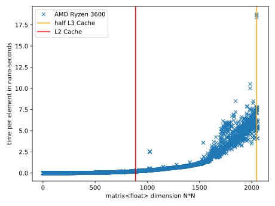

## Matrix multiplication on CPU
{width=100%}

{width=100%}

As can clearly be seen the performance tends to drop with increasing problem size and shows large dips especially around $N~2^x$, e.g. $N=256$ and $N=1024$.
The noise in the regime $N <~ 200$ can probably be explained by a warmup taken for the branch predictor and differences in scheduling between the runs.

The dips in performance can be attributed to cache misses, running the binary under `perf stat` shows `60,36% backend cycles idle` and `4,39% L1-dcache misses` for a problem size of 300 but `87,26% backend cycles idle` and `50,16% L1-dcache misses` for 512. This implies that the CPU performs less than one instruction (0,79) per cycle, which is terrible considering the chip should be super-scalar.

For $N=5000$ the cache can be assumed to be fully ineffective, as the problem size exceeds the L3 cache and the sustained Flops/s are $0.54$ Gflop/s. As the measurements beyond $N=1500$ are increasingly noisy, most likely due to the fact that the L3 cache is shared between cores (and fully reserving a multi-core CPU with a single threaded workload seems unrealistic), this should only be seen as a rough estimate, but is a far cry from the $~5$ Gflops/s achieved at peak.

$C(5)=A(5)B(5)$:

|||||
|:----:|:----:|:----:|:---:|
|0|30|60|90|120|
|0|40|80|120|160|
|0|50|100|150|200|
|0|60|120|180|240|
|0|70|140|210|280|
